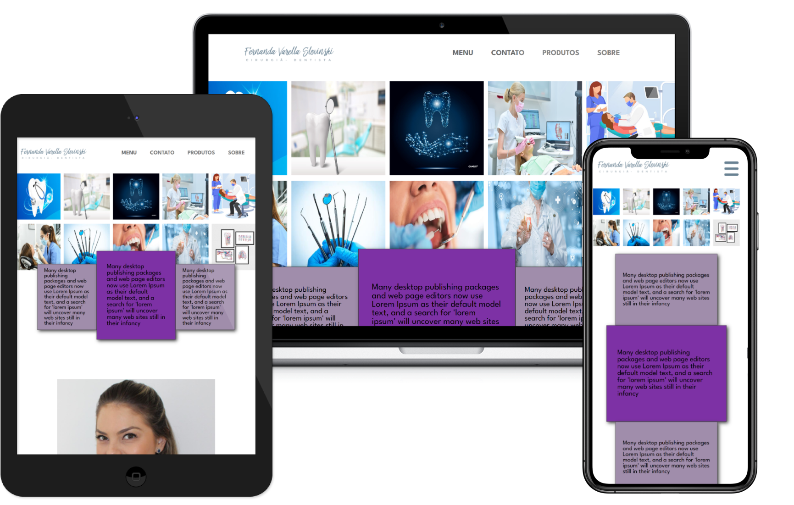

<h1> :beginner: Landing-page clone pagina odontológica </h1>

<h1> :page_with_curl: Description</h1>

Projeto de landing-page da série de projetos Learning To Code, outro projeto simples em que o design foi acessado através da plataforma Danki Code, página estática 
clone de um site odontológico, projeto criado em maio de 2022 e atualmente pouco modificado para publicar remotamente. 

<h1> :camera: Images </h1>

<h3> :hammer: Technologies and Tools</h3>

  :heavy_check_mark:   HTML5 | 
     :heavy_check_mark:   CSS3 

<h3> :construction_worker: Author</h3>

   
  

